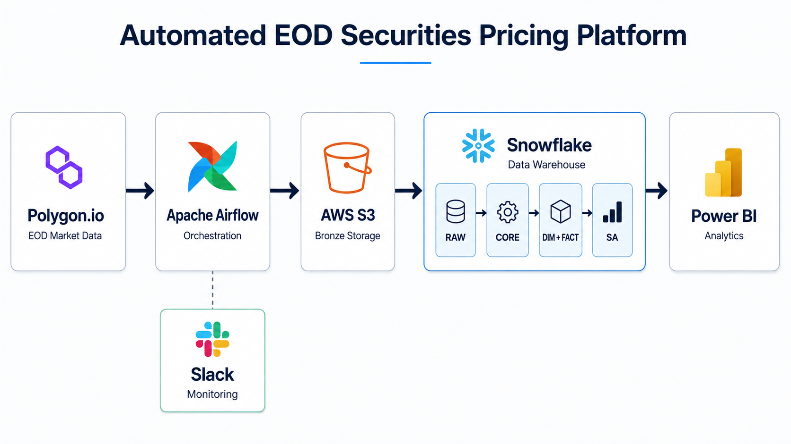
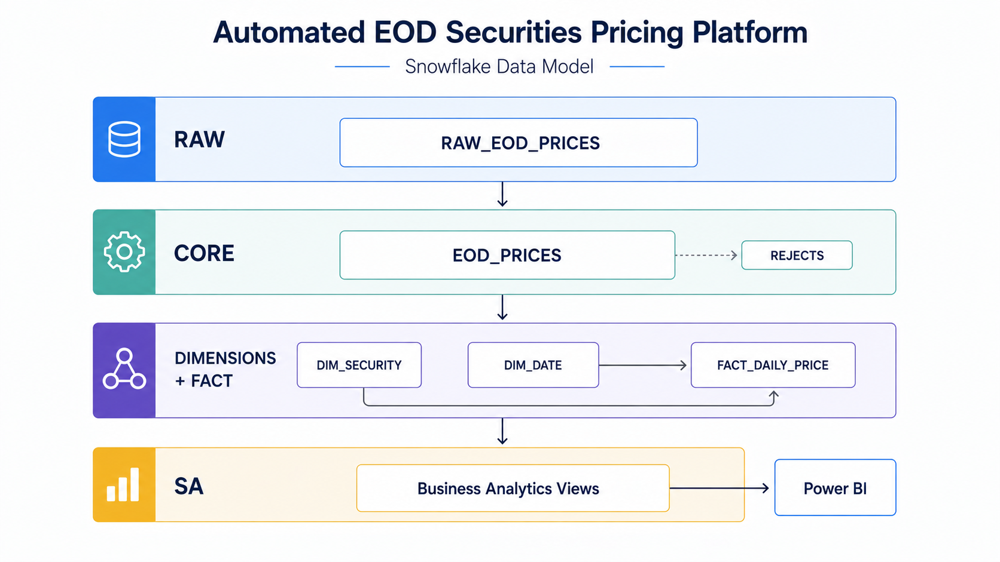
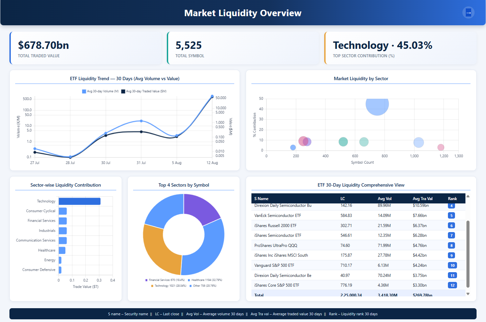
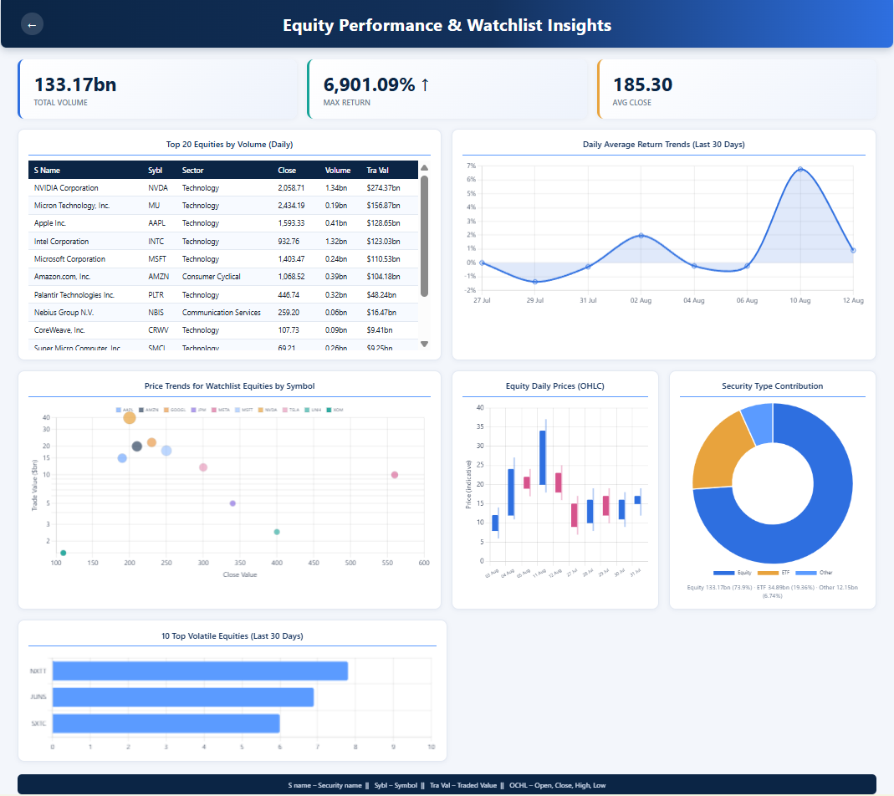

# Automated EOD Securities Pricing Platform

> An end-to-end batch data platform for ingesting U.S. securities EOD pricing
> data, processing it through AWS S3 and Snowflake, and delivering curated
> liquidity and performance analytics through Power BI.

**Author:** [morid648](https://github.com/morid648)

**Stack:** Polygon.io · Python · Apache Airflow · AWS S3 · Snowflake · SQL · Docker · Power BI · Slack



---

## Overview

This platform automates the ingestion, validation, transformation, and
analytical delivery of U.S. securities end-of-day pricing and liquidity data.

It replaces a manual workflow of collecting market-data files and preparing
reports with a scheduled batch pipeline: **Polygon.io → AWS S3 → Snowflake →
Power BI**.

The pipeline supports both **historical backfill** and **daily incremental
processing**, with Snowflake providing layered storage and transformation
across RAW, CORE, dimensional, fact, and Subject Area (SA) layers.

Curated datasets support market liquidity analysis, sector-level liquidity
contribution, ETF activity, equity performance, daily returns, and watchlist
monitoring.

## Key Capabilities

| Capability | Implementation |
|---|---|
| Historical Backfill | Python-based extraction of historical EOD market data |
| Daily Ingestion | Scheduled Airflow DAG for weekday EOD processing |
| Trading-Day Resolution | Searches backward for the latest available trading day |
| Cloud Landing | AWS S3 Bronze layer for raw CSV files |
| Warehouse Ingestion | Snowflake external stage and `COPY INTO` |
| Data Quality | Validation, deduplication, and rejected-record handling |
| Incremental Processing | Snowflake `MERGE`-based upserts |
| Data Modeling | Security and Date dimensions with a daily pricing fact table |
| Analytical Layer | Curated Subject Area views for BI consumption |
| Monitoring | Airflow retries, pre/post-load metrics, and Slack notifications |
| BI Delivery | Power BI dashboards for market and liquidity insights |

## Architecture

```
Polygon.io
    ↓
Apache Airflow
    ↓
AWS S3 — Bronze
    ↓
Snowflake RAW
    ↓
CORE
    ↓
DIMENSIONS + FACT
    ↓
SA / Subject Area
    ↓
Power BI
```

Airflow orchestrates the daily workflow; Snowflake handles warehouse-side
validation, transformation, dimensional modeling, and analytical prep. Slack
handles task-failure alerts and end-of-run summaries.

## Repository Structure

```
polygon-eod-securities-pipeline/
│
├── dags/
│   ├── README.md
│   └── polygon_eod_pipeline_dag.py
│
├── lib/
│   ├── README.md
│   ├── eod_data_downloader.py
│   └── slack_utils.py
│
├── sql/
│   ├── README.md
│   ├── 01_copy_to_raw.sql
│   ├── 02_check_loaded.sql
│   ├── 03_premerge_metrics.sql
│   ├── 04_merge_core.sql
│   ├── 05_merge_dim_security.sql
│   ├── 06_merge_dim_date.sql
│   ├── 07_merge_fact_daily_price.sql
│   └── 08_postmerge_metrics.sql
│
├── historical_load/
│   ├── README.md
│   ├── extract_historical_data.py
│   └── load_transform_historical_data.sql
│
├── snowflake/
│   ├── README.md
│   ├── init_snowflake_objects.sql
│   ├── load_daily_eod_prices.sql
│   ├── reject_table.sql
│   └── sec_pricing_views.sql
│
├── powerbi/
│   ├── README.md
│   ├── securities_market_insights.pbix
│   ├── securities_market_insights.pdf
│   ├── market_liquidity_overview.jpg
│   └── equity_watchlist_insights.jpg
│
├── docs/
│   ├── README.md
│   ├── data_flow.md
│   ├── data_quality.md
│   ├── architecture.png
│   ├── data_model.png
│   ├── daily_eod_data_pipeline.png
│   └── test_scripts/
│       ├── README.md
│       ├── test_aws_connection.py
│       ├── test_slack_connection.py
│       └── test_snowflake_connection.py
│
├── .env.example
├── .gitignore
├── docker-compose.yaml
├── LICENSE
├── CONTRIBUTING.md
├── CHANGELOG.md
└── README.md
```

Each folder has its own README with file-level detail and run instructions.

## Historical Backfill

`historical_load/extract_historical_data.py` calls the Polygon grouped daily
endpoint across a configured date range and writes a structured CSV
(trade date, symbol, OHLCV, source file, ingestion timestamp).
`historical_load/load_transform_historical_data.sql` then merges that data
through the same CORE → Dimensions → FACT structure used by the daily
pipeline, so both paths land in a consistent model. See
`historical_load/README.md` for details.

## Daily Incremental Pipeline

Orchestrated by Apache Airflow, running weekdays:

1. **Resolve trading day** — search backward within a lookback window until Polygon returns data
2. **Extract** — download grouped EOD data to a temporary CSV
3. **Verify local file** — confirm the CSV was created before continuing
4. **Land in S3** — upload to the Bronze path
5. **Load Snowflake RAW** — via external stage + `COPY INTO`
6. **Pre-merge checks** — row counts, rejects, estimated inserts/updates
7. **Merge into CORE** — normalize, deduplicate, upsert
8. **Update dimensions** — Security and Date
9. **Merge fact data** — into `FACT_DAILY_PRICE`
10. **Post-merge checks** — CORE/FACT row counts after processing
11. **Slack summary** — publish run metrics


See `dags/README.md` for the exact task IDs and wiring.

## Data Quality & Reliability

- **Reject handling:** negative-volume records are routed to
  `CORE.EOD_PRICES_REJECT` with diagnostic metadata (symbol, OHLCV, reason,
  source file, ingestion/rejection timestamps) instead of being dropped
- **Deduplication:** `ROW_NUMBER()` over `(SYMBOL, TRADE_DATE)`, tie-broken by
  latest ingestion timestamp then source file
- **Incremental upserts:** Snowflake `MERGE` — no blind appends
- **Operational metrics:** RAW count, reject count, estimated/actual
  inserts and updates, tracked pre- and post-merge

Full detail in `docs/data_quality.md`.

## Snowflake Data Model

```
RAW → CORE → DIMENSIONS + FACT → SA
```

| Layer | Object | Purpose |
|---|---|---|
| RAW | `RAW_EOD_PRICES` | Source records + source-file/ingestion metadata |
| CORE | `EOD_PRICES` | Cleaned, deduplicated canonical pricing |
| CORE | `EOD_PRICES_REJECT` | Records failing data-quality checks |
| Dimension | `DIM_SECURITY` | Security business entity + surrogate key |
| Dimension | `DIM_DATE` | Calendar attributes (year, quarter, month, week, weekend flag) |
| Dimension | `DIM_SECURITY_ATTRIBUTES` | Name, type, sector, industry, website |
| Fact | `FACT_DAILY_PRICE` | OHLCV at the grain of one security × one trading date |



DDL for all of the above lives in `snowflake/init_snowflake_objects.sql` and
`snowflake/reject_table.sql`.

## Analytics Layer

The `SA` (Subject Area) schema exposes business-ready views so BI tools don't
need to reconstruct the warehouse model:

| View | Purpose |
|---|---|
| `VW_SECURITY_DAILY_PRICES` | Daily OHLCV enriched with security attributes |
| `VW_TOP20_EQUITY_BY_VOLUME_DAILY` | Daily top-20 equities by volume/traded value |
| `VW_WATCHLIST_HISTORY` | Historical pricing/liquidity for a watchlist |
| `VW_SECURITY_LAST_30D_DAILY_RETURN` | Recent daily returns via prior-close calc |
| `VW_SECTOR_LIQUIDITY_LATEST` | Latest-day sector liquidity and contribution |
| `VW_ETF_LIQUIDITY_30D_SUMMARY` | 30-day ETF liquidity averages and ranking |

Defined in `snowflake/sec_pricing_views.sql`.

## Power BI Analytics

Two dashboards consume the SA views:

**Market Liquidity Overview** — sector-wise liquidity contribution, total
traded value, ETF liquidity trends, 30-day ETF ranking.



**Equity Performance & Watchlist Insights** — daily return trends, OHLC
pricing, top equities by volume, watchlist performance.



Full report: [`powerbi/securities_market_insights.pdf`](powerbi/securities_market_insights.html).
Original `.pbix` included for reference in `powerbi/`.

## Monitoring & Alerting

**Airflow:** 3 retries, 5-minute retry delay, single active run, failure
callback, XCom-based trading-date propagation, dependency management via a
Snowflake TaskGroup.

**Slack — Failure Alerts:** DAG ID, task ID, run ID, error info, log link.

**Slack — EOD Summary:** trading date, RAW rows, reject rows, estimated
CORE inserts/updates, CORE rows, FACT rows.

## Technology Stack

| Category | Technologies |
|---|---|
| Data Source | Polygon.io |
| Programming | Python, SQL |
| Orchestration | Apache Airflow |
| Cloud Storage | AWS S3 |
| Data Warehouse | Snowflake |
| Data Modeling | Dimensional Modeling, Star Schema |
| Data Quality | Validation, Deduplication, Reject Handling |
| Containerization | Docker |
| Monitoring | Slack |
| Business Intelligence | Power BI |

## Setup & Configuration

### Prerequisites
- Docker Desktop
- Git
- Polygon.io API key
- AWS credentials with access to an S3 bucket
- Snowflake account credentials
- Slack Incoming Webhook

### 1. Clone the Repository
```bash
git clone https://github.com/morid648/automated-eod-securities-pricing.git
cd automated-eod-securities-pricing
```

### 2. Configure Environment Variables
```bash
cp .env.example .env
```
Populate the required values locally. **Do not commit `.env` or any
credentials to GitHub.**

### 3. Provision Snowflake
Run the scripts in `snowflake/` in order — see `snowflake/README.md` for the
exact sequence and required placeholder substitutions (AWS account ID, S3
bucket name).

### 4. Start Airflow
```bash
docker compose up -d
```
Starts the Airflow API server, scheduler, DAG processor, worker, triggerer,
PostgreSQL metadata database, and Redis broker.

### 5. Access Airflow
```
http://localhost:8080
```

### 6. Configure Airflow Connections and Variables
Set `POLYGON_API_KEY`, `LOOKBACK_DAYS`, `S3_BUCKET` as Variables, and
`aws_default`, `snowflake_default`, `slack_default` as Connections — via the
Airflow UI, not hardcoded into the DAG. Optionally verify each connection
first using `docs/test_scripts/`.

### 7. Run the Pipeline
Enable the DAG:
```
polygon_eod_data_downloader_final_v2
```
It resolves the latest trading day, extracts data, uploads to S3, loads
Snowflake, transforms, and posts the summary to Slack.

## Project Outcomes

- Automated daily EOD market-data ingestion
- Separated raw, cleaned, modeled, and analytical data layers
- Historical backfill alongside incremental daily processing
- Explicit detection and isolation of invalid records
- Dimensional and fact models maintained in Snowflake
- Reusable analytical views for BI consumption
- Operational visibility via Airflow and Slack
- Market liquidity and performance insights delivered through Power BI

## Learning & Acknowledgment

This project was developed as part of the **CodeBasics Data Engineering
learning journey**, with **Dhaval Patel** as the instructor.

## Future Improvements

- Automate enrichment of `DIM_SECURITY_ATTRIBUTES` (currently created empty)
- Add automated reconciliation between source API totals and Snowflake datasets
- Expand data-quality rules with configurable validation thresholds
- Extend the analytical layer with additional market-performance metrics

## Project Limitations

- No automated test suite (only manual connection-check DAGs in `docs/test_scripts/`)
- No CI/CD configuration
- `DIM_SECURITY_ATTRIBUTES` requires manual population from an external reference source

## License

Licensed under the [MIT License](LICENSE).
